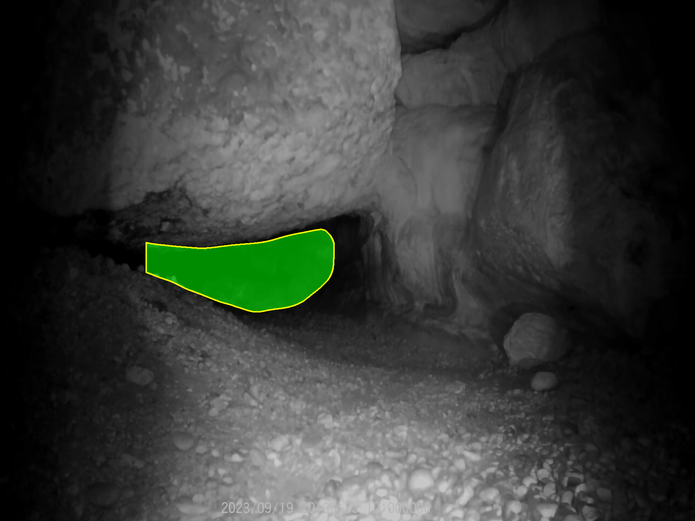
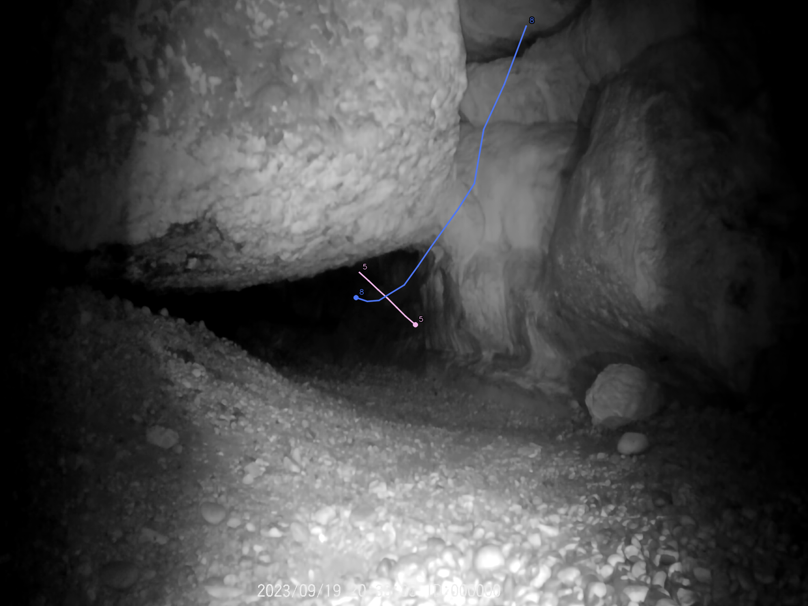

# bat_tracker

Proyecto Python para Linux orientado a CPU (con opcion CUDA cuando esta disponible) que procesa videos IR monocromos de cueva y genera:

- `background.png`: fondo por mediana temporal
- `valid_region/`: mascara vertical de zona valida estimada por perfil de iluminacion o profundidad
- `tracks.csv`: trayectorias 2D por objeto
- `track_candidates.csv`: evaluacion de todos los tracks candidatos con score y motivos de rechazo
- `events.csv`: resumen por track con direccion, duracion, desplazamiento y estadisticas
- `tracks.svg`: artefacto vectorial autocontenido con las trayectorias 2D en coordenadas originales
- `tracks_render.json`: geometria normalizada por track para consumo externo
- `tracks_overlay.png`: trayectorias sobre el fondo
- `flight_trails_overlay.mp4` (opcional): estelas temporales en tiempo real sobre el video original
- `fast_events.csv` y `fast_tracks.csv` (opcional): reconstruccion de eventos rapidos uniendo candidatos aceptados y rechazados
- `heatmap_events.csv` y `heatmap_tracks.csv` (opcional): reconstruccion cinemática de esos eventos desde heatmaps de movimiento
- `meta.json`: parametros y metricas de ejecucion

Por defecto no genera video anotado y no usa modelos entrenados.

## Instalacion

```bash
python3 -m venv .venv
source .venv/bin/activate
pip install -r requirements.txt
```

Opcionalmente, instalacion como paquete:

```bash
pip install -e .
```

## Uso

```bash
bat-tracker --input /path/video.mp4 --output /path/out_dir --config /path/config.yaml
```

O sin `--config` para usar defaults.

Tambien puede ejecutarse sin instalar entrypoint:

```bash
python -m bat_tracker --input /path/video.mp4 --output /path/out_dir --config /path/config.yaml
```

Generacion standalone de mascara vertical valida:

```bash
bat-valid-region \
  --input /path/out_dir/background.png \
  --output /path/out_dir/valid_region \
  --blur-kernel-size 151 \
  --threshold-ratio 0.45 \
  --safety-margin 10
```

Alternativamente:

```bash
python -m bat_tracker.valid_region --input /path/out_dir/background.png --output /path/out_dir/valid_region
```

## Ejemplo de Resultados

Aquí se muestran visualizaciones de las salidas generadas:

**1. Máscara de Zona Válida (Método Híbrido):**
*Filtra los laterales oscuros combinando profundidad en el centro y perfil de iluminación, reteniendo la zona útil.*


**2. Tracking Final:**
*Trayectorias 2D superpuestas sobre el fondo calculado.*


## Entradas

- `--input` (obligatorio): ruta a video IR monocromo, por ejemplo `.mp4`.
- `--output` (obligatorio): carpeta de salida donde se escriben resultados.
- `--config` (opcional): YAML con parametros; si no se pasa, usa defaults internos.

Ejemplos de configuracion incluidos:

- `config.yaml.example` (base)
- `config.out3_clean.yaml` (perfil limpio para escenas tipo out3 con menos ruido)

## Salidas

Se escriben en la carpeta indicada por `--output`:

- `background.png`: fondo estimado por mediana temporal.
- `valid_region/mask.png`: mascara binaria vertical (255 zona valida, 0 laterales invalidos).
- `valid_region/overlay.png`: debug visual de banda valida sobre la imagen.
- `valid_region/gate_overlay.png`: debug visual del gate real usado en tracking tras aplicar `valid_region_gate_dilate_px`.
- `valid_region/profile.png`: debug de region valida (perfil horizontal en modo `horizontal_illumination_profile`; mapa de profundidad en modos `central_deep_layer`/`hybrid_deep_layer_profile`).
- `tracks.csv`: trayectorias 2D por deteccion y frame.
- `track_candidates.csv`: auditoria opcional de todos los tracks candidatos tras merge, con `accepted`, `score` y `reject_reasons`.
- `fast_events.csv`: eventos rapidos reconstruidos desde candidatos, util para vuelos con blur, saltos grandes o salida de la mascara valida.
- `fast_tracks.csv`: puntos usados por cada evento rapido, con `event_id`, `source_track_id` y motivo de aceptacion/rechazo original.
- `fast_events_overlay.png`: overlay de los eventos rapidos reconstruidos.
- `heatmap_events.csv`: eventos rapidos refinados desde heatmap inter-frame, usando `fast_events` como semillas.
- `heatmap_tracks.csv`: puntos suavizados de la ruta extraida del corredor de movimiento del heatmap.
- `heatmap_events_overlay.png`: overlay de rutas cinemáticas por heatmap.
- `events.csv`: resumen por track con inicio/fin, duracion, desplazamiento, recorrido, straightness y direccion.
- `tracks.svg`: export vectorial autocontenido de todas las trayectorias en el sistema de coordenadas original del video, con el mismo color por `track_id` y las mismas etiquetas opcionales que `tracks_overlay.png`.
- `tracks_render.json`: export JSON con `width`, `height`, puntos por track y metadatos minimos (`track_id`, `frame_start`, `frame_end`, `duration_sec`, `direction`, `point_start`, `point_end`).
  - `direction` usa el vocabulario `entry`, `exit`, `inside`, `outside`, `unknown`.
- `tracks_overlay.png`: trayectorias dibujadas sobre `background.png`.
- `tracks_overlay_raw.png` y `tracks_overlay_smoothed.png` (opcionales): overlays adicionales cuando `output.trajectory_smoothing_enabled` esta activo.
- `flight_trails_overlay.mp4` (opcional): video con estelas temporales superpuestas sobre el video original cuando `flight_trails.enabled` esta activo.
- `track_clips/` (opcional): clips de video por track (`track_0001_000120-000186.mp4`, etc.).
- `meta.json`: metadatos del video, parametros efectivos y metricas de ejecucion.
  - incluye bloques `video`, `parameters`, `background`, `valid_region`, `metrics`, `execution`, `performance`, `outputs`, `trajectory_smoothing` y `postprocess`.
  - `postprocess` resume tambien cuantos candidatos se aceptaron/rechazaron y las causas mas frecuentes.

## Formato de tracks.csv

Columnas exactas:

`video_id,track_id,frame,time_sec,x,y,vx,vy,bbox_x1,bbox_y1,bbox_x2,bbox_y2,area`

## Formato de events.csv

Columnas exactas:

`video_id,track_id,time_start_sec,time_end_sec,duration_sec,frame_start,frame_end,num_detections,x_start,y_start,x_end,y_end,displacement_px,path_length_px,straightness,mean_speed_px_sec,mean_area,start_in_valid_region,end_in_valid_region,direction`

`direction` usa el vocabulario `entry`, `exit`, `inside`, `outside`, `unknown`.

## Pipeline implementado

1. Lectura del video y metadatos.
2. Generacion de `background.png` por mediana temporal de un muestreo de frames.
3. Deteccion de foreground por diferencia absoluta con el fondo.
4. Umbral binario (fijo u Otsu) + morfologia (open/close) + contornos.
5. Filtrado de blobs por area minima/maxima.
6. Tracking 2D frame a frame con asignacion greedy por distancia maxima y prediccion por velocidad para reducir cortes.
7. Merge automatico opcional de tracks fragmentados antes del filtrado final.
8. Evaluacion centralizada de tracks candidatos (score + motivos de rechazo) y export de `tracks.csv`, `events.csv`, `tracks.svg`, `tracks_render.json` y render final `tracks_overlay.png`.
9. Export opcional de `flight_trails_overlay.mp4` con estelas temporales acumuladas sobre el video original si `flight_trails.enabled`.
10. Si `valid_region.enabled`, calculo de banda vertical valida desde iluminacion horizontal y guardado en `valid_region/*`.
11. Export de `meta.json` con parametros, metadatos y metricas.
   - incluye `postprocess.auto_merges_applied` cuando `tracking.auto_merge_suggested` esta activo.
   - incluye `trajectory_smoothing.enabled/window` y rutas extra de overlay cuando el suavizado esta activado.

## Configuracion

Usa `config.yaml.example` como base.

- `background.sample_frames`: numero de frames para mediana temporal
- `background.uniform_sampling`: muestreo uniforme en todo el video
- `background.input_image`: si se define, reutiliza un fondo precomputado y omite la mediana temporal
- `background.context_start_sec`: segundo inicial de la ventana usada para estimar `background.png`
- `background.context_duration_sec`: duracion de esa ventana; `-1` usa el video entero
- `detection.*`: parametros de blur, threshold, morfologia y area
  - `detection.threshold_mode`: `fixed` o `otsu`
  - `detection.otsu_offset`: ajuste fino sobre umbral Otsu (negativo = mas sensible)
  - `detection.max_global_intensity_shift`: descarta frame si el brillo medio difiere demasiado del fondo (`-1` desactiva)
  - `detection.max_foreground_ratio`: descarta frame si el porcentaje de foreground es demasiado alto (`-1` desactiva)
  - `detection.max_detections_per_frame`: descarta frame si supera este numero de blobs (`0` desactiva)
  - `detection.roi_x_min/roi_x_max/roi_y_min/roi_y_max`: limita detecciones a una ROI por centroide (`-1` desactiva cada limite)
  - `detection.temporal_burst_*`: gate temporal por rafagas de detecciones (desactiva con `0`)
    - `temporal_burst_min_detections`: umbral de detecciones altas por frame
    - `temporal_burst_window_frames`: tamano de ventana temporal
    - `temporal_burst_trigger_frames`: frames altos dentro de ventana para activar suppression
    - `temporal_burst_cooldown_frames`: frames suprimidos tras activacion
- `tracking.*`: distancia maxima de asociacion, tolerancia a frames perdidos y filtros minimos por trayectoria
  - `tracking.min_track_length`: minimo de puntos por trayectoria
  - `tracking.min_track_duration_sec`: duracion minima en segundos (si se define, se combina con `min_track_length`)
  - `tracking.min_track_displacement`: desplazamiento neto minimo (pixeles)
  - `tracking.min_track_path_length`: recorrido acumulado minimo (pixeles)
  - `tracking.min_track_straightness`: rectitud minima `desplazamiento/recorrido` (0..1)
  - `tracking.require_start_or_end_in_valid_region`: conserva solo tracks que empiezan o acaban dentro de la mascara valida
  - `tracking.valid_region_gate_dilate_px`: dilata la mascara valida en pixeles antes de aplicar el filtro inicio/fin
  - `tracking.auto_merge_suggested`: fusion automatica postproceso de tracks potencialmente duplicados
  - `tracking.export_track_candidates`: escribe `track_candidates.csv` con todos los tracks evaluados, incluidos los rechazados
  - `tracking.merge_max_gap_frames` y `tracking.merge_max_endpoint_distance`: merge por handoff cercano (fin->inicio)
  - `tracking.merge_overlap_min_common_frames`: minimo de frames comunes para evaluar merge por solape
  - `tracking.merge_overlap_max_mean_distance`: distancia media maxima en frames comunes
  - `tracking.merge_overlap_min_direction_cosine`: coherencia minima de direccion entre tracks solapados
- `fast_events.*`: capa opcional para reconstruir salidas muy rapidas agrupando candidatos aceptados/rechazados
  - `fast_events.enabled`: activa los CSV/overlay de eventos rapidos.
  - `fast_events.include_rejected_candidates`: permite usar candidatos descartados por filtros como `valid_region_gate`.
  - `fast_events.min_source_*`: filtros para elegir fragmentos candidatos antes de agruparlos.
  - `fast_events.max_group_*`: tolerancias temporal/espacial para unir fragmentos en un mismo evento.
- `heatmap_events.*`: capa opcional posterior a `fast_events` que reconstruye la ruta sobre el rastro acumulado de movimiento
  - `heatmap_events.enabled`: activa `heatmap_events.csv`, `heatmap_tracks.csv` y `heatmap_events_overlay.png`.
  - `heatmap_events.threshold/percentile`: sensibilidad del heatmap inter-frame.
  - `heatmap_events.corridor_width/bins`: anchura del corredor y resolucion de la ruta extraida.
  - `heatmap_events.seed_y_min/y_max`: limites para evitar que ruido de bordes deforme la ruta.
- `flight_trails.*`: export opcional de video con estelas temporales sobre el video original
  - `flight_trails.enabled`: activa `flight_trails_overlay.mp4`; por defecto esta desactivado.
  - `flight_trails.video_filename`: nombre del fichero mp4 generado dentro del directorio de salida.
  - `flight_trails.history_frames` y `flight_trails.max_track_gap_frames`: memoria temporal por track antes de cortar una estela.
  - `flight_trails.decay`: factor de desvanecimiento del mapa acumulativo entre frames.
  - `flight_trails.segment_thickness` y `flight_trails.point_radius`: grosor visual de la estela y del punto mas reciente.
  - `flight_trails.overlay_alpha` y `flight_trails.colormap`: mezcla del overlay y mapa de color aplicado al heatmap.
  - `flight_trails.min_*` y `flight_trails.stationary_radius_px`: filtros para exigir trayectorias coherentes y rechazar jitter/movimiento local persistente.
- `valid_region.*`: mascara vertical valida para eliminar vignette lateral IR sin recortar interior oscuro de cueva
  - `valid_region.enabled`: activa/desactiva etapa
  - `valid_region.method`: `horizontal_illumination_profile` (default), `central_deep_layer` o `hybrid_deep_layer_profile` (perfil primero y profundidad despues, sin laterales)
  - `valid_region.apply_to_detection`: aplica mascara en deteccion por frame (si no, se usa solo para filtros de track)
  - `valid_region.hybrid_combine_mode`: `and`/`or` para combinar capa de profundidad + umbral por perfil
  - `valid_region.input_image`: si se define, usa esta imagen en vez de `background.png`
  - `valid_region.input_mask`: si se define, reutiliza exactamente esta mascara y omite su estimacion
  - `valid_region.context_start_sec` y `valid_region.context_duration_sec`: permiten estimar la mascara con una ventana temporal distinta a la del fondo de deteccion
  - `valid_region.blur_kernel_size` y `valid_region.profile_smooth_window`: deben ser impares
  - `valid_region.threshold_ratio`: fraccion del pico del perfil para definir region valida
  - `valid_region.safety_margin`: recorte adicional en pixeles por lado
  - `valid_region.min_region_width_ratio`: evita regiones absurdamente estrechas
  - `valid_region.depth_percentile/depth_morph_kernel/depth_min_area_ratio`: parametros del modo `central_deep_layer`
  - `valid_region.depth_layer_percentiles` + `valid_region.depth_layer_dilate_px`: expansion no uniforme por capas de profundidad (listas emparejadas)
  - `valid_region.bottom_contour_*`: refinado opcional del borde inferior ajustandolo al gradiente vertical de profundidad (`*_search_*` define ventana de busqueda, `*_smooth_window` suaviza la curva, `*_gradient_quantile` controla sensibilidad, `*_regularization`/`*_max_step_px` reducen muescas, `*_downward_bias` permite bajar cuando hay empate, `*_regularization_mix` mezcla ajuste local/global, `*_deepest_strong_ratio` favorece el borde fuerte mas profundo frente a crestas intermedias)
- `output.*`: estilo del overlay y artefactos de salida
  - `output.overlay_line_thickness`: grosor de linea en `tracks_overlay.png` y `tracks.svg`
  - `output.overlay_start_radius`: radio del marcador del primer punto del track
  - `output.overlay_alpha`: alpha del overlay raster `tracks_overlay.png`
  - `output.overlay_draw_track_labels`: dibuja el numero de `track_id` junto al inicio de cada track en `tracks_overlay.png` y `tracks.svg`
  - `output.overlay_draw_track_labels_at_end`: dibuja el numero de `track_id` al final del track en `tracks_overlay.png` y `tracks.svg`
  - `output.overlay_label_font_scale` y `output.overlay_label_thickness`: estilo de etiqueta compartido por `tracks_overlay.png` y `tracks.svg`
  - `output.progress_enabled`: muestra trazas de avance global por consola durante todo el pipeline (etapas + frames)
  - `output.progress_step_percent`: porcentaje global entre trazas (1..100, por defecto `5`)
  - `output.export_track_clips`: exporta clips por track en una carpeta
  - `output.track_clips_subdir`: nombre de la carpeta de clips dentro del output
  - `output.track_clips_padding_frames`: frames extra antes/despues del rango del track
  - `output.trajectory_smoothing_enabled`: genera una version suavizada de las trayectorias para overlays y `events.csv`
  - `output.trajectory_smoothing_window`: ventana impar >= 3 usada en el suavizado
- `execution.*`: seleccion de backend de computo
  - `execution.device`: `auto` (default), `cpu` o `cuda`
  - `execution.strict_parity`: cuando esta en `true`, compara mascara CPU/GPU y conserva la salida CPU para mantener resultados equivalentes al pipeline original
  - etapa extra GPU: el calculo de `background.png` por mediana usa CuPy si esta instalado; si no, cae automaticamente a CPU

## Ajuste rapido para mejorar recall/continuidad

Si faltan sujetos o aparecen tracks cortados:

1. subir `tracking.max_distance` (ej. `70-90`)
2. subir `tracking.max_missed` (ej. `15-25`)
3. bajar `detection.min_area` (ej. `4-8`)
4. usar `detection.threshold_mode: otsu` y ajustar `detection.otsu_offset` (ej. `-6` mas sensible)

Si aparecen demasiados tracks de ruido:

1. subir `tracking.min_track_displacement` (ej. `20-40`)
2. subir `tracking.min_track_path_length` (ej. `30-80`)
3. subir `tracking.min_track_straightness` (ej. `0.1-0.3`)
4. subir `background.sample_frames` (ej. `100-300`) para estabilizar `background.png`
5. activar gates anti-flicker en `detection`: `max_global_intensity_shift`, `max_foreground_ratio`, `max_detections_per_frame`
6. activar gate temporal `detection.temporal_burst_*` para suprimir rafagas cortas de ruido

## Tests minimos

```bash
pytest
```

Los tests cubren deteccion, tracking y export/render de salida.

## Agradecimientos / Referencias

Parte de los parámetros y perfiles de uso incluidos en este proyecto se han inspirado en el enfoque y resultados de la herramienta **[ThruTracker](https://github.com/AaronJCorcoran/ThruTracker)** desarrollada por Aaron J. Corcoran. Recomendaos consultar su repositorio en GitHub.

## Licencia

Este proyecto está bajo la licencia **Creative Commons Attribution-NonCommercial 4.0 International (CC BY-NC 4.0)**. 

Esto significa que eres libre de compartir, copiar, distribuir, ejecutar y comunicar públicamente la obra, así como hacer obras derivadas, bajo las siguientes condiciones:
- **Atribución (Attribution)**: Debes reconocer adecuadamente la autoría, proporcionar un enlace a la licencia e indicar si se han realizado cambios.
- **No Comercial (NonCommercial)**: No puedes utilizar el material para una finalidad comercial.

Para ver una copia de esta licencia, visita [https://creativecommons.org/licenses/by-nc/4.0/](https://creativecommons.org/licenses/by-nc/4.0/) o revisa el archivo `LICENSE` incluido en este repositorio.
